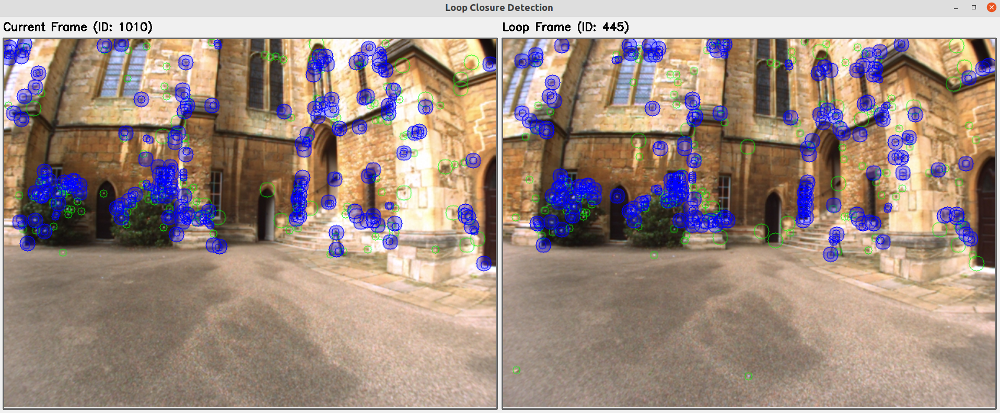

# BoWG

## The code will be made public before publication. In the meantime, you can find an introduction to this repository on this page.

BoWG is an open-source C++ library for loop closure detection and place recognition, serving as the official implementation of our paper "Bag-of-Word-Groups (BoWG): A Robust and Efficient Loop Closure Detection Method Under Perceptual Aliasing". For a practical demonstration of integrating BoWG into SLAM systems, we provide another repository [BoWG_VINS_Loop](https://github.com/EdgarFx/BoWG_VINS_Loop), which showcases the implementation of BoWG in [VINS-Fusion](https://github.com/HKUST-Aerial-Robotics/VINS-Fusion).

**Core Features**
- Visual loop closure detection method *robust* against *perceptual aliasing*
- *High computational efficiency* and *excellent scalability* comparable to bag-of-binary-words (DBoW series), making it ideal for large-scale and long-term applications
- *Word Groups* exploiting the spatial co-occurrence and local structure of detected features, enriching image distinguishability
- Hierarchical word vocabulary tree (offline trained) combined with dynamically established word group table, delivering context-specific representation
- *Word* and *Word Group* inverse index tables for efficient database querying and similarity scoring
- Direct index table for efficient feature matching and geometrical verification
- Advanced temporal consistency and feature distribution analysis integrated into similarity score computation
- Supports various types of scoring: L1-norm, L2-norm, Chi-Square, KL-divergence, Bhattacharyya coefficient, Dot Product
- Dedicated temporal and geometrical post-verification modules
- Vocabulary training tools for custom applications
- Ready-to-use demo programs for quick testing with image sequences

<p align="center">
  
</p>
<p align="center">
  <em>BoWG demo detector on New College dataset</em>
</p>

<p align="center">
  
</p>
<p align="center">
  <em>VINS-Fusion with BoWG on EuRoC MH_03_medium sequence</em>
</p>

## 1. Prerequisites
### 1.1 Operating Systems
BoWG is compatible with Ubuntu, macOS, and Windows. Ubuntu is recommended, as other systems may require minor modifications. If you encounter any compatibility issues, please create an issue in our repository with your system details and problem description.

### 1.2 OpenCV
Please follow the official [OpenCV Installation](https://docs.opencv.org/4.10.0/d0/d3d/tutorial_general_install.html) guide.

### 1.3 Boost
BoWG utilizes the `boost::dynamic_bitset` class.

For Ubuntu:
```
$ sudo apt-get install libboost-dev
```

For macOS:
```
brew install boost
```

For Windows:

- Download and install [Boost](https://www.boost.org/).

## 2. Build BoWG

To set up BoWG, clone the repository:
```
git clone https://github.com/EdgarFx/BoWG.git
```

Build the project:
```
cd BoWG
mkdir build
cd build
cmake ..
make -j4
```

## 3. Demo Usage
1. Download the [Public Datasets](https://drive.google.com/drive/folders/1PnfZlGjDvFHNkNHyG63hNQLT4_6Dk3Wv?usp=sharing) (New College, City Centre, Bicocca) to YOUR_DATASET_FOLDER
2. Modify the dataset path in `config/demo.yaml`
3. Move to the build directory and run the demo

With GUI interface:
```
./demo --gui
```
The GUI displays processing images and corresponding loop closure results. Press 'p' to pause/resume the program.


<p align="center">
  
</p>

To adjust processing speed for better visualization, use the `--delay` parameter (in milliseconds for each image):
```
./demo --gui --delay 20
```

For terminal-only execution:
```
./demo
```

Performance metrics (precision, recall, true positives, false positives, etc.) can be computed when ground truth data is provided. For the New College sample, ground truth data is included. The ground truth a `.txt` file with the following format:
```
95: 1,2  # Image 95 matches with images 1 and 2
96: 1,2,3
97: 2,3,4
98: 3,4,5
```

For detailed usage information of the demo program:
```
./demo --help
```

## 4. Run with Your Own Dataset
Our demo program is not restricted to the provided sample datasets, as it implements a ready-to-use detector that can process any sequence of images. To use the demo program with your own dataset:
1. Modify `image_path` in the config file to point to your image directory
2. Set `gt_use` to 0 in the config file if ground truth data is unavailable
3. Execute the following commend
```
./demo --config ../config/my_config.yaml --gui
```

## 5. Train Your Own Word Vocabulary
Our vocabulary uses a binary format. Source code is located in `./src/Train_Voc/train_voc.cpp`, with the executable in `./build/train_voc`. 

To train your own vocabulary:
```
cd build
./train_voc <image_folder> <vocabulary_output>
```
Please specify the complete path for vocabulary output including the file name, e.g., `./my_voc_folder/brief_voc.bin`.


## 6. Integrate BoWG into SLAM Systems
Please check our additional repository [BoWG_VINS_Loop](https://github.com/EdgarFx/BoWG_VINS_Loop), which demonstrates the integration of BoWG in [VINS-Fusion](https://github.com/HKUST-Aerial-Robotics/VINS-Fusion). This project serves as a reference for integrating BoWG into other SLAM systems.

## 7. Acknowledgements
This project builds upon the foundations of: [DBoW2](https://github.com/dorian3d/DBoW2/tree/master), [DLib](https://github.com/dorian3d/DLib), [DLoopDetector](https://github.com/dorian3d/DLoopDetector/tree/master) and [VINS-Mono](https://github.com/HKUST-Aerial-Robotics/VINS-Mono).

## 8. License
The source code is released under [BSD 3-Clause License](https://opensource.org/license/bsd-3-clause).